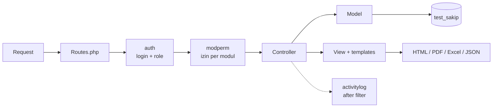
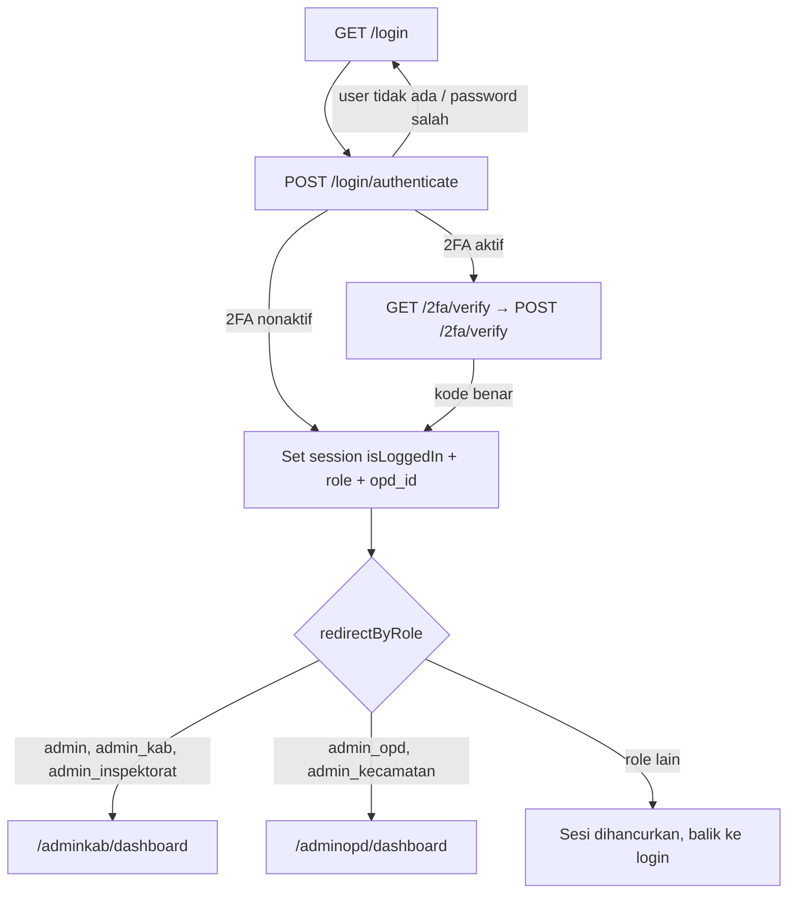
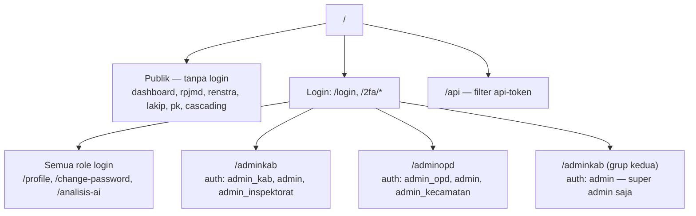
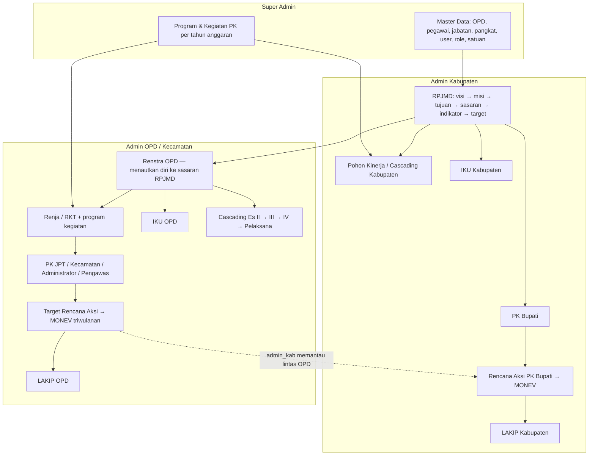
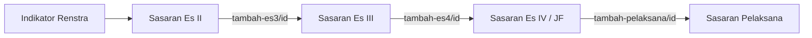

# Alur Fitur & Route — e-SAKIP (AKSARA) Kabupaten Pringsewu

Dokumen tunggal berisi **alur fitur per modul** dan **seluruh route** aplikasi.
Disusun dari [app/Config/Routes.php](app/Config/Routes.php), filter di [app/Filters/](app/Filters/),
dan menu di [app/Views/templates/admin_menu.php](app/Views/templates/admin_menu.php) — per **28 Juli 2026**.

Dokumen pendamping: [db/ERD.md](db/ERD.md) (struktur data) · [db/RELASI_SAKIP.md](db/RELASI_SAKIP.md) (kerangka KemenPAN-RB) · [API_DOCUMENTATION.md](API_DOCUMENTATION.md).

---

## Daftar Isi

1. [Arsitektur singkat](#1-arsitektur-singkat)
2. [Role & alur login](#2-role--alur-login)
3. [Lapisan pengaman route](#3-lapisan-pengaman-route)
4. [Peta area URL](#4-peta-area-url)
5. [Alur besar: satu siklus SAKIP](#5-alur-besar-satu-siklus-sakip)
6. [Route publik (tanpa login)](#6-route-publik-tanpa-login)
7. [Route umum pengguna login](#7-route-umum-pengguna-login)
8. [Area Kabupaten — `/adminkab`](#8-area-kabupaten--adminkab)
9. [Area Perangkat Daerah — `/adminopd`](#9-area-perangkat-daerah--adminopd)
10. [Area Super Admin](#10-area-super-admin)
11. [API bertoken](#11-api-bertoken)
12. [Konvensi pola route](#12-konvensi-pola-route)
13. [Route yang sengaja dinonaktifkan](#13-route-yang-sengaja-dinonaktifkan)

---

## 1. Arsitektur singkat

CodeIgniter 4, MVC klasik, tanpa SPA. Setiap request menempuh jalur:



- **Controller** tipis, logika query berat ada di **Model** (`app/Models/`, sub-folder `Opd/`).
- **Helper** dipakai lintas modul: `format_helper`, `rbac_helper`, `cascading_label_helper`,
  `cascading_excel_helper`, `lakip_excel_helper`, `setting_helper`.
- Cetak PDF memakai **mpdf** (partial `templates/pdf_style.php` + `templates/pdf_kop.php`),
  ekspor Excel memakai **PhpSpreadsheet**.

---

## 2. Role & alur login

Lima role tersimpan di `users.role`:

| Role | Area | Sifat |
|---|---|---|
| `admin` | semua | Super admin — lolos semua pemeriksaan izin |
| `admin_kab` | `/adminkab` | Pengelola dokumen tingkat kabupaten |
| `admin_inspektorat` | `/adminkab` | Read-only lintas OPD (evaluasi) |
| `admin_opd` | `/adminopd` | Pengelola dokumen satu OPD |
| `admin_kecamatan` | `/adminopd` | Sama dengan `admin_opd`, label eselon digeser satu tingkat |



Mapping role→URL hanya ada di satu tempat: `LoginController::redirectByRole()`.
Sidebar tunggal [admin_menu.php](app/Views/templates/admin_menu.php) memfilter item menu
dengan `user_can('<modul>.<aksi>')`, jadi tiap role otomatis hanya melihat menunya.

---

## 3. Lapisan pengaman route

Empat filter, tiga di antaranya berlapis pada area admin:

| Filter | Alias | Dipasang di | Tugas |
|---|---|---|---|
| `AuthFilter` | `auth` | argumen grup route | Wajib login; argumen = daftar role yang boleh |
| `ModulePermissionFilter` | `modperm` | `Config/Filters.php` untuk `adminkab/*` & `adminopd/*` | Turunkan (modul, aksi) dari URL lalu cek `user_can()` |
| `PermissionFilter` | `permission` | manual per route | Cek satu permission spesifik |
| `ApiTokenFilter` | `api-token` | grup `api` | Validasi token API |
| `ActivityLogFilter` | `activitylog` | after filter | Catat aksi ke `activity_logs` |

**Cara `modperm` menebak izin** — segmen pertama setelah `adminkab`/`adminopd` dipetakan ke nama modul,
lalu aksi ditebak dari kata kunci di URL:

| Kata kunci di URL | Aksi yang diperiksa |
|---|---|
| `delete` | `delete` |
| `import`, `tambah` | `create` |
| `save` | `create` **atau** `update` |
| `update`, `edit`, `status` | `update` |
| selain itu (`index`, `cetak`, …) | `view` |

Peta modulnya:

```
adminkab: rpjmd, rkpd, iku→iku_kab, cascading→cascading_kab, target→target_kab,
          monev/target_renaksi/pk/renaksi_pk/monev_pk/pk_bupati → pk_bupati,
          lakip→lakip_kab, program_pk, tentang_kami, dashboard

adminopd: renstra, rkt→rkt_opd, iku→iku_opd, cascading→cascading_opd, target→target_opd,
          monev/target_renaksi/pk/renaksi_pk/monev_pk → pk_opd,
          lakip→lakip_opd, tentang_kami, dashboard
```

Route yang tidak terpetakan (mis. helper AJAX, panel master) **lolos** `modperm` dan
mengandalkan filter `auth` di grupnya. Super admin (`admin`) selalu lolos.

---

## 4. Peta area URL



Perhatikan: prefix `/adminkab` dipakai **dua grup route berbeda**. Grup pertama untuk
`admin_kab, admin, admin_inspektorat`; grup kedua khusus `admin` (master data, program PK,
pegawai, log aktivitas, pengaturan aplikasi).

---

## 5. Alur besar: satu siklus SAKIP

Urutan kerja lintas role dalam satu tahun anggaran:



Kuncinya: **Renstra OPD wajib menautkan diri ke sasaran RPJMD** (`renstra_tujuan.rpjmd_sasaran_id`),
dan **MONEV adalah satu-satunya sumber realisasi** — baik untuk PK maupun LAKIP.

---

## 6. Route publik (tanpa login)

Halaman informasi untuk masyarakat; semuanya `GET` dan dilayani `UserController`.

| Route | Handler | Isi |
|---|---|---|
| `/` | `Home::index` | Landing |
| `/unauthorized` | `Home::unauthorized` | Halaman tolak akses |
| `/dashboard` | `UserController::index` | Beranda publik |
| `/rpjmd` | `UserController::rpjmd` | RPJMD kabupaten |
| `/rkpd` | `UserController::rkpd` | RKPD |
| `/rkt` | `UserController::rkt` | RKT |
| `/renstra` | `UserController::renstra` | Renstra OPD |
| `/iku_opd` | `UserController::iku_opd` | IKU OPD |
| `/lakip_kabupaten` | `UserController::lakip_kabupaten` | LAKIP kabupaten |
| `/lakip_opd` | `UserController::lakip_opd` | LAKIP OPD |
| `/pk_bupati` | `UserController::pk_bupati` | PK Bupati |
| `/pk_pimpinan` | `UserController::pk_pimpinan` | PK Pimpinan |
| `/pk_administrator` | `UserController::pk_administrator` | PK Administrator (Es III) |
| `/pk_pengawas` | `UserController::pk_pengawas` | PK Pengawas (Es IV) |
| `/tentang_kami` | `UserController::tentang_kami` | Profil aplikasi |
| `/api-docs` | `ApiDocsController::index` | Dokumentasi API |

**Cascading & Pohon Kinerja publik** — masing-masing punya tampilan layar, cetak PDF, Excel, dan cetak pohon:

| Route | Handler |
|---|---|
| `/cascading_kabupaten` | `UserController::cascading_kabupaten` |
| `/cascading_kabupaten/cetak` | `UserController::cascading_kabupaten_cetak` |
| `/cascading_kabupaten/excel` | `UserController::cascading_kabupaten_excel` |
| `/cascading_kabupaten/cetak-pohon` | `UserController::cascading_kabupaten_pohon` |
| `/pohon_kinerja_kabupaten` | `UserController::pohon_kinerja_kabupaten` |
| `/pohon_kinerja_kabupaten/cetak` | `UserController::cascading_kabupaten_pohon` |
| `/cascading_opd` | `UserController::cascading_opd` |
| `/cascading_opd/cetak` | `UserController::cascading_opd_cetak` |
| `/cascading_opd/excel` | `UserController::cascading_opd_excel` |
| `/cascading_opd/cetak-pohon` | `UserController::cascading_opd_pohon` |
| `/pohon_kinerja_opd` | `UserController::pohon_kinerja_opd` |
| `/pohon_kinerja_opd/cetak` | `UserController::cascading_opd_pohon` |

> Menu **RENJA publik dinonaktifkan** — belum ada tabel `renja` maupun method `UserController::renja`.

---

## 7. Route umum pengguna login

Filter `auth` tanpa batasan role.

| Method | Route | Handler | Fungsi |
|---|---|---|---|
| GET | `/login` | `LoginController::index` | Form login |
| POST | `/login/authenticate` | `LoginController::authenticate` | Proses login |
| GET | `/logout` | `LoginController::logout` | Hancurkan sesi |
| GET | `/2fa/verify` | `TwoFactorController::verify` | Langkah verifikasi saat login |
| POST | `/2fa/verify` | `TwoFactorController::verifyPost` | Cek kode TOTP |
| GET | `/2fa/setup` | `TwoFactorController::setup` | Pasang authenticator |
| POST | `/2fa/enable` · `/2fa/disable` | `TwoFactorController::enable` / `disable` | Aktif/nonaktif 2FA |
| GET | `/profile` | `ProfileController::index` | Profil pengguna |
| GET | `/change-password` | `ChangePasswordController::index` | Form ganti sandi |
| POST | `/change-password/update` | `ChangePasswordController::update` | Simpan sandi baru |
| GET | `/analisis-ai` | `AiAnalysisController::index` | Panel analisis AI (Gemini) |
| POST | `/analisis-ai/run` | `AiAnalysisController::run` | Jalankan analisis |

---

## 8. Area Kabupaten — `/adminkab`

`['filter' => 'auth:admin_kab,admin,admin_inspektorat']`

### 8.1 Dashboard & Evaluasi

| Method | Route | Handler |
|---|---|---|
| GET | `adminkab/dashboard` | `AdminKabupatenController::dashboard` |
| GET/POST | `adminkab/dashboard/data` | `AdminKabupatenController::getDashboardData` |
| GET | `adminkab/dashboard/pk-bupati/(:num)` | `AdminKabupatenController::pkBupatiDetail` |
| GET | `adminkab/dashboard/opd/(:num)` | `AdminKabupatenController::opdDetail` |
| GET | `adminkab/dashboard/status-opd/(:segment)` | `AdminKabupatenController::statusOpd` |
| GET | `adminkab/dashboard/misi/(:num)` | `AdminKabupatenController::misiDetail` |
| GET | `adminkab/dashboard/anggaran-kinerja` | `AdminKabupatenController::anggaranKinerja` |
| GET | `adminkab/evaluasi_inspektorat` | `AdminKabupatenController::evaluasi_inspektorat` *(placeholder)* |

**Dashboard Pengendalian Kinerja Kabupaten** (`App\Services\KabupatenDashboardService`) punya
dua mode dalam satu halaman: **Mode Kabupaten** (filter OPD = semua) dan **Mode Fokus OPD**
(satu OPD dipilih — kartu & grafik berganti konteks, tetap di `/adminkab`). Endpoint JSON di atas
hanya melayani drawer/grafik dan selalu memvalidasi ulang `opd_id`, tahun, triwulan, serta misi.
| GET | `adminkab/tentang_kami` | `AdminKabupatenController::tentang_kami` |
| GET | `adminkab/tentang_kami/edit` | `AdminKabupatenController::edit_tentang_kami` |
| POST | `adminkab/tentang_kami/save` | `AdminKabupatenController::save_tentang_kami` |

### 8.2 RPJMD

**Alur:** daftar → tambah/edit satu rangkaian (misi → tujuan → sasaran → indikator → target tahunan
dalam satu form) → ubah status draft/selesai → cetak PDF.

| Method | Route | Handler |
|---|---|---|
| GET | `adminkab/rpjmd` | `RpjmdController::index` |
| GET | `adminkab/rpjmd/tambah` | `RpjmdController::tambah` |
| POST | `adminkab/rpjmd/save` | `RpjmdController::save` |
| GET | `adminkab/rpjmd/edit/(:num)` | `RpjmdController::edit` |
| POST | `adminkab/rpjmd/update` | `RpjmdController::update` |
| GET/POST/DELETE | `adminkab/rpjmd/delete/(:num)` | `RpjmdController::delete` |
| POST | `adminkab/rpjmd/update-status` | `RpjmdController::updateStatus` |
| GET | `adminkab/rpjmd/cetak` | `RpjmdController::cetak` |

### 8.3 RKPD — read-only

Turunan RKT OPD; hanya bisa dilihat dan dicetak.

| Method | Route | Handler |
|---|---|---|
| GET | `adminkab/rkpd` | `RkpdController::index` |
| GET | `adminkab/rkpd/cetak` | `RkpdController::cetak` |

### 8.4 IKU Kabupaten

Modul mandiri (tabel `iku_sasaran/iku_indikator/iku_target/iku_program`, `opd_id` NULL = kabupaten).
Parameter `(:num)` pada edit/delete adalah **id sasaran IKU**, bukan id indikator RPJMD.

**Alur:** daftar → tambah manual **atau** `sync` (tarik sasaran+indikator+target dari RPJMD) →
edit → ubah status per indikator → cetak.

| Method | Route | Handler |
|---|---|---|
| GET | `adminkab/iku` | `AdminKab\IkuController::index` |
| GET | `adminkab/iku/tambah` | `AdminKab\IkuController::tambah` |
| POST | `adminkab/iku/save` | `AdminKab\IkuController::save` |
| GET | `adminkab/iku/edit/(:num)` | `AdminKab\IkuController::edit` |
| POST | `adminkab/iku/update` | `AdminKab\IkuController::update` |
| GET/POST/DELETE | `adminkab/iku/delete/(:num)` | `AdminKab\IkuController::delete` |
| GET | `adminkab/iku/sync` | `AdminKab\IkuController::sync` |
| POST | `adminkab/iku/sync/simpan` | `AdminKab\IkuController::syncSimpan` |
| POST | `adminkab/iku/change_status/(:num)` | `AdminKab\IkuController::change_status` |
| GET | `adminkab/iku/cetak` | `AdminKab\IkuController::cetak` |

### 8.5 Cascading / Pohon Kinerja Kabupaten

Satu controller melayani **tiga mode** lewat query `?mode=` (kabupaten / OPD / keseluruhan)
dan **dua tampilan** lewat `?view=` (`pohon` / `tabel`).

| Method | Route | Handler |
|---|---|---|
| GET | `adminkab/cascading` | `AdminKab\CascadingController::index` |
| GET | `adminkab/cascading/tambah/(:num)` | `AdminKab\CascadingController::tambah` |
| POST | `adminkab/cascading/save` | `AdminKab\CascadingController::save` |
| POST | `adminkab/cascading/save-csf` | `AdminKab\CascadingController::saveCsf` |
| GET | `adminkab/cascading/get-pk-program-by-opd` | `AdminKab\CascadingController::getPkProgramByOpd` *(AJAX)* |
| GET | `adminkab/cascading/cetak` | `AdminKab\CascadingController::cetak` *(PDF A3-landscape)* |
| GET | `adminkab/cascading/cetak-pohon` | `AdminKab\CascadingController::cetakPohon` |
| GET | `adminkab/cascading/excel` | `AdminKab\CascadingController::excel` |

### 8.6 Perjanjian Kinerja Bupati

Route PK memakai pola `pk/(:any)` — segmen `(:any)` adalah **jenis PK** (`bupati`, `jpt`, `kecamatan`,
`administrator`, `pengawas`). Di area kabupaten yang dipakai adalah `bupati`.

| Method | Route | Handler |
|---|---|---|
| GET | `adminkab/pk/(:any)` | `AdminOpd\PkController::index` |
| GET | `adminkab/pk/(:any)/tambah` | `AdminOpd\PkController::tambah` |
| POST | `adminkab/pk/(:any)/save` | `AdminOpd\PkController::save` |
| GET | `adminkab/pk/(:any)/edit/(:num)` | `AdminOpd\PkController::edit` |
| POST | `adminkab/pk/(:any)/update/(:num)` | `AdminOpd\PkController::update` |
| GET/POST/DELETE | `adminkab/pk/(:any)/delete/(:num)` | `AdminOpd\PkController::delete` |
| GET | `adminkab/pk/(:any)/cetak/(:num)` | `AdminOpd\PkController::cetak` |
| GET | `adminkab/pk-pegawai-search` | `AdminOpd\PkController::pegawaiSearch` *(Select2 AJAX, lintas OPD untuk Plt./Plh.)* |

### 8.7 Rencana Aksi & MONEV PK Bupati

Dua "wajah" untuk controller yang sama, `AdminOpd\PkRenaksiController`:

- **URL bersih** `target_renaksi` / `monev` — jenis dipatok `bupati`.
- **URL generik** `renaksi_pk/(:any)` / `monev_pk/(:any)` — jenis diambil dari segmen,
  dipakai admin kabupaten untuk memantau PK OPD (`es3`) lintas perangkat daerah.

**Alur:** susun rencana aksi + target triwulan → (opsional) tetapkan OPD pendukung →
isi capaian triwulanan di MONEV → isi realisasi anggaran → cetak.

| Method | Route | Handler |
|---|---|---|
| GET | `adminkab/target_renaksi` | `PkRenaksiController::index/bupati` |
| GET | `adminkab/target_renaksi/tambah` | `PkRenaksiController::tambah/bupati` |
| POST | `adminkab/target_renaksi/save` | `PkRenaksiController::save/bupati` |
| GET | `adminkab/target_renaksi/edit/(:num)` | `PkRenaksiController::edit/bupati` |
| POST | `adminkab/target_renaksi/update/(:num)` | `PkRenaksiController::update/bupati` |
| GET | `adminkab/target_renaksi/pd/(:num)` | `PkRenaksiController::kelolaPd/bupati` |
| POST | `adminkab/target_renaksi/pd/save` | `PkRenaksiController::savePd/bupati` |
| GET | `adminkab/target_renaksi/cetak` | `PkRenaksiController::cetakRenaksi/bupati` |
| GET | `adminkab/monev` | `PkRenaksiController::monev/bupati` |
| GET | `adminkab/monev/input/(:num)` | `PkRenaksiController::monevForm/bupati` |
| POST | `adminkab/monev/save` | `PkRenaksiController::monevSave/bupati` |
| GET | `adminkab/monev/anggaran/(:num)` | `PkRenaksiController::monevAnggaranForm/bupati` |
| POST | `adminkab/monev/anggaran/save` | `PkRenaksiController::monevAnggaranSave/bupati` |
| GET | `adminkab/monev/cetak` | `PkRenaksiController::cetak/bupati` |

Versi generik (`(:any)` = jenis PK):

| Method | Route |
|---|---|
| GET | `adminkab/renaksi_pk/(:any)` · `/tambah` · `/edit/(:num)` · `/cetak` |
| POST | `adminkab/renaksi_pk/(:any)/save` · `/update/(:num)` |
| GET | `adminkab/monev_pk/(:any)` · `/input/(:num)` · `/anggaran/(:num)` · `/cetak` |
| POST | `adminkab/monev_pk/(:any)/save` · `/anggaran/save` |

### 8.8 Target Kabupaten

| Method | Route | Handler |
|---|---|---|
| GET | `adminkab/target` | `AdminKab\TargetController::index` |
| GET | `adminkab/target/tambah` | `AdminKab\TargetController::tambah` |
| POST | `adminkab/target/save` | `AdminKab\TargetController::save` |
| GET | `adminkab/target/edit/(:num)` | `AdminKab\TargetController::edit` |
| POST | `adminkab/target/update/(:num)` | `AdminKab\TargetController::update` |
| GET | `adminkab/target/cetak` | `AdminKab\TargetController::cetak` |

### 8.9 LAKIP Kabupaten

Halaman LAKIP terdiri dari **tiga tabel**: capaian, Analisis Faktor, dan Efisiensi Program.
Dua tabel tambahan ditulis lewat POST dan lingkupnya (tahun/mode/OPD) diverifikasi ulang di server
oleh `LakipAddendumTrait`.

| Method | Route | Handler |
|---|---|---|
| GET | `adminkab/lakip` | `AdminKab\LakipController::index` |
| GET | `adminkab/lakip/tambah/(:num)` | `AdminKab\LakipController::tambah` |
| POST | `adminkab/lakip/save` | `AdminKab\LakipController::save` |
| GET | `adminkab/lakip/edit/(:num)` | `AdminKab\LakipController::edit` |
| POST | `adminkab/lakip/update/` | `AdminKab\LakipController::update` |
| GET/POST/DELETE | `adminkab/lakip/delete/(:num)` | `AdminKab\LakipController::delete` |
| GET | `adminkab/lakip/status/(:num)/(:segment)` | `AdminKab\LakipController::status` |
| POST | `adminkab/lakip/analisis/save` | `AdminKab\LakipController::analisisSave` |
| POST | `adminkab/lakip/analisis/delete/(:num)` | `AdminKab\LakipController::analisisDelete` |
| POST | `adminkab/lakip/efisiensi/save` | `AdminKab\LakipController::efisiensiSave` |
| POST | `adminkab/lakip/efisiensi/delete/(:num)` | `AdminKab\LakipController::efisiensiDelete` |
| GET | `adminkab/lakip/cetak` | `AdminKab\LakipController::cetak` *(PDF)* |
| GET | `adminkab/lakip/cetak-excel` | `AdminKab\LakipController::cetakExcel` |

---

## 9. Area Perangkat Daerah — `/adminopd`

`['filter' => 'auth:admin_opd,admin,admin_kecamatan']`

Semua modul di area ini otomatis tersaring `opd_id` dari sesi. Untuk `admin_kecamatan`,
label eselon pada Cascading digeser satu tingkat (II→III, III→IV, IV/JF→Pelaksana) lewat helper
`casc_relabel` — kosmetik saja, nilai `level` di database tetap `es2/es3/es4`.

### 9.1 Dashboard & halaman statis

| Method | Route | Handler |
|---|---|---|
| GET | `adminopd/dashboard` | `AdminOpdController::index` |
| GET/POST | `adminopd/dashboard/data` | `AdminOpdController::data` |
| GET | `adminopd/dashboard/indicator/(:num)` | `AdminOpdController::indicator` |
| GET | `adminopd/dashboard/status/(:segment)` | `AdminOpdController::status` |
| GET | `adminopd/dashboard/program/(:num)` | `AdminOpdController::program` |
| GET | `adminopd/tentang_kami` | `AdminOpdController::tentang_kami` |
| GET | `adminopd/evaluasi_inspektorat` | `AdminOpdController::evaluasi_inspektorat` *(stub)* |

### 9.2 Renstra

**Alur:** tambah sasaran + indikator + target tahunan sekaligus, dengan **memilih sasaran RPJMD**
sebagai induk → edit tujuan terpisah → ubah status → cetak.

| Method | Route | Handler |
|---|---|---|
| GET | `adminopd/renstra` | `AdminOpd\RenstraController::index` |
| GET | `adminopd/renstra/tambah` | `AdminOpd\RenstraController::tambah_renstra` |
| POST | `adminopd/renstra/save` | `AdminOpd\RenstraController::save` |
| GET | `adminopd/renstra/edit/(:num)` | `AdminOpd\RenstraController::edit` |
| POST | `adminopd/renstra/update/(:num)` | `AdminOpd\RenstraController::update` |
| GET | `adminopd/renstra/edit-tujuan/(:num)` | `AdminOpd\RenstraController::editTujuan` |
| POST | `adminopd/renstra/update-tujuan/(:num)` | `AdminOpd\RenstraController::updateTujuan` |
| GET/POST/DELETE | `adminopd/renstra/delete/(:num)` | `AdminOpd\RenstraController::delete` |
| POST | `adminopd/renstra/update-status` | `AdminOpd\RenstraController::updateStatus` |
| GET | `adminopd/renstra/cetak` | `AdminOpd\RenstraController::cetak` |

### 9.3 Renja / RKT

`tambah/(:num)` menerima **id indikator Renstra**; penghapusan dilakukan per indikator, bukan per baris RKT.

| Method | Route | Handler |
|---|---|---|
| GET | `adminopd/rkt` | `AdminOpd\RktController::index` |
| GET | `adminopd/rkt/tambah/(:num)` | `AdminOpd\RktController::tambah` |
| POST | `adminopd/rkt/save` | `AdminOpd\RktController::save` |
| GET | `adminopd/rkt/edit/(:num)` | `AdminOpd\RktController::edit` |
| POST | `adminopd/rkt/update` | `AdminOpd\RktController::update` |
| POST | `adminopd/rkt/delete-indikator` | `AdminOpd\RktController::deleteByIndicator` |
| POST | `adminopd/rkt/update-status` | `AdminOpd\RktController::updateStatus` |
| GET | `adminopd/rkt/cetak` | `AdminOpd\RktController::cetak` |

### 9.4 IKU OPD

Pola identik IKU kabupaten; `sync` menarik dari **Renstra OPD**, bukan RPJMD.

| Method | Route | Handler |
|---|---|---|
| GET | `adminopd/iku` | `AdminOpd\IkuController::index` |
| GET | `adminopd/iku/tambah` | `AdminOpd\IkuController::tambah` |
| POST | `adminopd/iku/save` | `AdminOpd\IkuController::save` |
| GET | `adminopd/iku/edit/(:num)` | `AdminOpd\IkuController::edit` |
| POST | `adminopd/iku/update` | `AdminOpd\IkuController::update` |
| GET/POST/DELETE | `adminopd/iku/delete/(:num)` | `AdminOpd\IkuController::delete` |
| GET | `adminopd/iku/sync` | `AdminOpd\IkuController::sync` |
| POST | `adminopd/iku/sync/simpan` | `AdminOpd\IkuController::syncSimpan` |
| POST | `adminopd/iku/change_status/(:num)` | `AdminOpd\IkuController::change_status` |
| GET | `adminopd/iku/cetak` | `AdminOpd\IkuController::cetak` |

### 9.5 Cascading / Pohon Kinerja OPD

Empat jenjang, tiap jenjang punya set route sendiri dengan pola yang persis sama.
`(:num)` pada `tambah-*` adalah **id induk** (sasaran satu jenjang di atas).



| Method | Route | Handler |
|---|---|---|
| GET | `adminopd/cascading` | `AdminOpd\CascadingController::index` |
| GET | `adminopd/cascading/table` | `AdminOpd\CascadingController::partialTable` *(partial AJAX)* |
| POST | `adminopd/cascading/save` | `AdminOpd\CascadingController::save` |
| POST | `adminopd/cascading/savecsf` | `AdminOpd\CascadingController::saveCsf` |
| GET | `adminopd/cascading/tambah-es3/(:num)` | `tambahEs3` |
| POST | `adminopd/cascading/save-es3` | `saveEs3` |
| GET | `adminopd/cascading/edit-es3/(:num)` | `editEs3` |
| POST | `adminopd/cascading/update-es3/(:num)` | `updateEs3` |
| POST | `adminopd/cascading/delete-es3/(:num)` | `deleteEs3` |
| GET | `adminopd/cascading/tambah-es4/(:num)` | `tambahEs4` |
| POST | `adminopd/cascading/save-es4` | `saveEs4` |
| GET | `adminopd/cascading/edit-es4/(:num)` | `editEs4` |
| POST | `adminopd/cascading/update-es4/(:num)` | `updateEs4` |
| POST | `adminopd/cascading/delete-es4/(:num)` | `deleteEs4` |
| GET | `adminopd/cascading/tambah-pelaksana/(:num)` | `tambahPelaksana` |
| POST | `adminopd/cascading/save-pelaksana` | `savePelaksana` |
| GET | `adminopd/cascading/edit-pelaksana/(:num)` | `editPelaksana` |
| POST | `adminopd/cascading/update-pelaksana/(:num)` | `updatePelaksana` |
| POST | `adminopd/cascading/delete-pelaksana/(:num)` | `deletePelaksana` |
| GET | `adminopd/cascading/cetak` | `cetak` |
| GET | `adminopd/cascading/cetakpohon` | `cetakPohon` |
| GET | `adminopd/cascading/excel` | `excel` |

> Perhatikan beda ejaan: kabupaten memakai `cetak-pohon`, OPD memakai `cetakpohon`.

### 9.6 Perjanjian Kinerja OPD

Satu set route `pk/(:any)` melayani empat menu, dibedakan segmen jenis:

| Menu di sidebar | URL | Terlihat oleh |
|---|---|---|
| PK JPT (Eselon II) | `adminopd/pk/jpt` | `admin_opd`, `admin` |
| PK Kecamatan (Eselon III) | `adminopd/pk/kecamatan` | `admin_kecamatan`, `admin` |
| PK Administrator (Eselon III) | `adminopd/pk/administrator` | semua role area OPD |
| PK Pengawas (Eselon IV) | `adminopd/pk/pengawas` | semua role area OPD |

> Segmen URL `kecamatan` disimpan sebagai `pk.jenis = 'camat'` (PkController: `$jenis === 'kecamatan' ? 'camat' : $jenis`),
> dengan struktur data identik JPT — Camat adalah puncak kecamatan. Redirect tetap memakai segmen URL aslinya.

| Method | Route | Handler |
|---|---|---|
| GET | `adminopd/pk/(:any)` | `AdminOpd\PkController::index` |
| GET | `adminopd/pk/(:any)/tambah` | `AdminOpd\PkController::tambah` |
| POST | `adminopd/pk/(:any)/save` | `AdminOpd\PkController::save` |
| GET | `adminopd/pk/(:any)/edit/(:num)` | `AdminOpd\PkController::edit` |
| POST | `adminopd/pk/(:any)/update/(:num)` | `AdminOpd\PkController::update` |
| GET/POST/DELETE | `adminopd/pk/(:any)/delete/(:num)` | `AdminOpd\PkController::delete` |
| GET | `adminopd/pk/(:any)/cetak/(:num)` | `AdminOpd\PkController::cetak` |
| GET | `adminopd/pk-pegawai-search` | `AdminOpd\PkController::pegawaiSearch` |

### 9.7 Target Rencana Aksi & MONEV OPD

Sama seperti kabupaten, tetapi jenis dipatok `es3`.

| Method | Route | Handler |
|---|---|---|
| GET | `adminopd/target_renaksi` | `PkRenaksiController::index/es3` |
| GET | `adminopd/target_renaksi/tambah` | `PkRenaksiController::tambah/es3` |
| POST | `adminopd/target_renaksi/save` | `PkRenaksiController::save/es3` |
| GET | `adminopd/target_renaksi/edit/(:num)` | `PkRenaksiController::edit/es3` |
| POST | `adminopd/target_renaksi/update/(:num)` | `PkRenaksiController::update/es3` |
| GET | `adminopd/target_renaksi/cetak` | `PkRenaksiController::cetakRenaksi/es3` |
| GET | `adminopd/monev` | `PkRenaksiController::monev/es3` |
| GET | `adminopd/monev/input/(:num)` | `PkRenaksiController::monevForm/es3` |
| POST | `adminopd/monev/save` | `PkRenaksiController::monevSave/es3` |
| GET | `adminopd/monev/anggaran/(:num)` | `PkRenaksiController::monevAnggaranForm/es3` |
| POST | `adminopd/monev/anggaran/save` | `PkRenaksiController::monevAnggaranSave/es3` |
| GET | `adminopd/monev/cetak` | `PkRenaksiController::cetak/es3` |

Versi generik `renaksi_pk/(:any)` dan `monev_pk/(:any)` juga tersedia di area OPD dengan pola
yang sama seperti di §8.7 — bedanya, di sini **tidak ada** route `monev_pk/(:any)/anggaran/*`.

### 9.8 Target OPD

| Method | Route | Handler |
|---|---|---|
| GET | `adminopd/target` | `AdminOpd\TargetController::index` |
| GET | `adminopd/target/tambah` | `AdminOpd\TargetController::tambah` |
| POST | `adminopd/target/save` | `AdminOpd\TargetController::save` |
| GET | `adminopd/target/edit/(:num)` | `AdminOpd\TargetController::edit` |
| POST | `adminopd/target/update/(:num)` | `AdminOpd\TargetController::update` |

### 9.9 LAKIP OPD

Struktur identik LAKIP kabupaten (capaian + analisis faktor + efisiensi program).

| Method | Route | Handler |
|---|---|---|
| GET | `adminopd/lakip` | `AdminOpd\LakipOpdController::index` |
| GET | `adminopd/lakip/tambah/(:num)` | `AdminOpd\LakipOpdController::tambah` |
| POST | `adminopd/lakip/save` | `AdminOpd\LakipOpdController::save` |
| GET | `adminopd/lakip/edit/(:num)` | `AdminOpd\LakipOpdController::edit` |
| POST | `adminopd/lakip/update/` | `AdminOpd\LakipOpdController::update` |
| GET/POST/DELETE | `adminopd/lakip/delete/(:num)` | `AdminOpd\LakipOpdController::delete` |
| GET | `adminopd/lakip/status/(:num)/(:segment)` | `AdminOpd\LakipOpdController::status` |
| POST | `adminopd/lakip/analisis/save` · `analisis/delete/(:num)` | `analisisSave` / `analisisDelete` |
| POST | `adminopd/lakip/efisiensi/save` · `efisiensi/delete/(:num)` | `efisiensiSave` / `efisiensiDelete` |
| GET | `adminopd/lakip/cetak` · `lakip/cetak-excel` | `cetak` / `cetakExcel` |

---

## 10. Area Super Admin

Grup kedua di prefix `adminkab`, `['filter' => 'auth:admin']`.

### 10.1 Master Data (satu halaman tabbed)

| Method | Route | Handler |
|---|---|---|
| GET | `adminkab/master` | `SuperAdmin\MasterController::index` |
| GET | `adminkab/master/pegawai-data` | `SuperAdmin\MasterController::pegawaiData` *(DataTables server-side)* |
| POST | `adminkab/master/pegawai/save` · `pangkat/save` · `jabatan/save` · `opd/save` · `user/save` · `role/save` · `satuan/save` | `*Save` |
| GET/POST/DELETE | `adminkab/master/{entitas}/delete/(:num)` | `*Delete` |
| POST | `adminkab/master/role/permissions` | `rolePermSave` |

### 10.2 Program & Kegiatan PK

| Method | Route | Handler |
|---|---|---|
| GET | `adminkab/program_pk` | `ProgramPkController::index` |
| GET | `adminkab/program_pk/tambah` | `ProgramPkController::tambah` |
| POST | `adminkab/program_pk/save` | `ProgramPkController::save` |
| GET | `adminkab/program_pk/edit/(:num)` | `ProgramPkController::edit` |
| POST | `adminkab/program_pk/update/(:num)` | `ProgramPkController::update` |
| POST | `adminkab/program_pk/delete/(:num)` | `ProgramPkController::delete` |
| GET | `adminkab/program_pk/import` | `ProgramPkController::import` |
| GET | `adminkab/program_pk/template` | `ProgramPkController::template` *(unduh template Excel)* |
| POST | `adminkab/program_pk/import/process` | `ProgramPkController::processImport` |

### 10.3 Pegawai & sinkron SIMPEG/SIKASN

| Method | Route | Handler |
|---|---|---|
| GET | `adminkab/pegawai` | `AdminKab\PegawaiController::index` |
| GET | `adminkab/pegawai/edit/(:num)` | `AdminKab\PegawaiController::edit` |
| POST | `adminkab/pegawai/update/(:num)` | `AdminKab\PegawaiController::update` |
| GET | `adminkab/pegawai/jabatan` | `AdminKab\PegawaiController::jabatan` |
| POST | `adminkab/pegawai/jabatan/update/(:num)` | `AdminKab\PegawaiController::updateJabatan` |
| GET | `adminkab/pegawai/sync` | `AdminKab\PegawaiController::sync` |
| POST | `adminkab/pegawai/sync/run` | `AdminKab\PegawaiController::runSync` *(OPD, pangkat, jabatan, pegawai)* |

### 10.4 Log Aktivitas & Pengaturan Aplikasi

| Method | Route | Handler |
|---|---|---|
| GET | `adminkab/log-aktivitas` | `AdminKab\ActivityLogController::index` |
| GET | `adminkab/log-aktivitas/pdf` | `AdminKab\ActivityLogController::pdf` |
| POST | `adminkab/log-aktivitas/clear` | `AdminKab\ActivityLogController::clearOld` |
| GET | `adminkab/pengaturan` | `SettingController::index` |
| POST | `adminkab/pengaturan/save` | `SettingController::save` *(nama aplikasi, instansi, logo, favicon, SEO, penandatangan)* |

### 10.5 Pengaturan Dashboard — Ambang Status Capaian

Rentang persentase, nama, warna, dan ikon status capaian yang dipakai **seluruh dashboard**
(OPD & Kabupaten). Tersimpan di tabel `dashboard_status_thresholds`; dibaca lewat
`getAchievementStatus()` pada `app/Helpers/dashboard_status_helper.php` — rentangnya tidak
pernah di-hardcode di controller/model/view/JavaScript.

| Method | Route | Handler |
|---|---|---|
| GET | `adminkab/dashboard-thresholds` | `AdminKab\DashboardThresholdController::index` |
| POST | `adminkab/dashboard-thresholds/save` | `AdminKab\DashboardThresholdController::save` *(validasi: min ≤ maks, tanpa tumpang tindih, tanpa celah, satu rentang tanpa batas atas, warna dari palet)* |
| POST | `adminkab/dashboard-thresholds/reset` | `AdminKab\DashboardThresholdController::reset` |

---

## 11. API bertoken

Grup `api`, filter `api-token`. Detail parameter & contoh respons ada di [API_DOCUMENTATION.md](API_DOCUMENTATION.md)
dan halaman hidup `/api-docs`.

| Method | Route | Handler |
|---|---|---|
| GET | `api/perangkat-daerah` | `Api\PerangkatDaerahController::index` |
| GET | `api/perangkat-daerah/(:num)` | `::show` |
| GET | `api/perangkat-daerah/(:num)/iku` | `::iku` |
| GET | `api/perangkat-daerah/(:num)/cascading` | `::cascading` |
| GET | `api/perangkat-daerah/(:num)/pohon-kinerja` | `::pohonKinerja` |
| GET | `api/iku` · `api/cascading` · `api/pohon-kinerja` | versi lintas OPD |

---

## 12. Konvensi pola route

Hampir semua modul CRUD mengikuti pola yang sama — mengenali polanya cukup untuk menebak route modul mana pun:

| Pola | Method | Arti |
|---|---|---|
| `<modul>` | GET | Daftar / index |
| `<modul>/tambah` atau `/tambah/(:num)` | GET | Form tambah; `(:num)` = id induk |
| `<modul>/save` | POST | Simpan baru |
| `<modul>/edit/(:num)` | GET | Form ubah |
| `<modul>/update` atau `/update/(:num)` | POST | Simpan perubahan |
| `<modul>/delete/(:num)` | GET/POST/DELETE | Hapus |
| `<modul>/update-status` atau `/status/(:num)/(:segment)` | POST/GET | Ubah status draft/selesai |
| `<modul>/cetak` | GET | Cetak PDF (mpdf) |
| `<modul>/cetak-excel` atau `/excel` | GET | Ekspor Excel (PhpSpreadsheet) |

Tiga pengecualian yang perlu diingat:

1. **PK** memakai segmen jenis di tengah: `pk/(:any)/edit/(:num)`, bukan `pk/edit/(:num)`.
2. **Rencana Aksi/MONEV** punya dua bentuk URL untuk controller yang sama — bersih (`target_renaksi`, `monev`) dan generik (`renaksi_pk/(:any)`, `monev_pk/(:any)`).
3. **Cascading OPD** memakai akhiran jenjang: `save-es3`, `save-es4`, `save-pelaksana`.

Urutan pendaftaran route penting: route spesifik selalu didaftarkan **sebelum** route ber-wildcard,
mis. `target_renaksi/pd/save` sebelum `target_renaksi/edit/(:num)`.

---

## 13. Route yang sengaja dinonaktifkan

Dikomentari di `Routes.php`, jangan diaktifkan tanpa menambah method controllernya lebih dulu:

| Route | Alasan |
|---|---|
| `/renja` (publik) | Method `UserController::renja` dan tabel `renja` belum ada; menu ikut disembunyikan |
| `adminkab/capaian_pk/*` | Fitur lama tanpa method — digantikan `PkRenaksiController` + MONEV |
| `adminopd/capaian_pk/(:any)` | Idem |
| `adminkab/lakip/download/(:num)`, `lakip/update-status` | Method tidak ada; status LAKIP dilayani `lakip/status/(:num)/(:segment)` |
| `adminopd/lakip/download/(:num)`, `lakip/update-status` | Idem |
| `adminkab/rkpd/tambah|edit|save|update|delete|update-status` | `RkpdController` hanya punya `index()`; RKPD read-only, view tambah/edit adalah orphan |
| `adminopd/rkt/delete/(:num)` | Method `delete()` tidak ada; hapus lewat `rkt/delete-indikator` |
| `adminopd/cascading/tambah/(:num)`, `get-pk-program-by-opd` | Digantikan route per jenjang (`tambah-es3`, `tambah-es4`, `tambah-pelaksana`) |
| `adminkab/pk_bupati/cetak` | Controller `AdminKab\PkBupatiController` tidak ada; cetak lewat `pk/(:any)/cetak/(:num)` |
| `adminkab/rkt` | RKT hanya ada di tingkat OPD |
