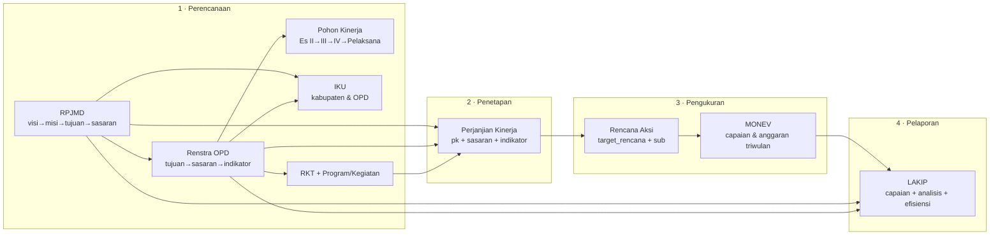
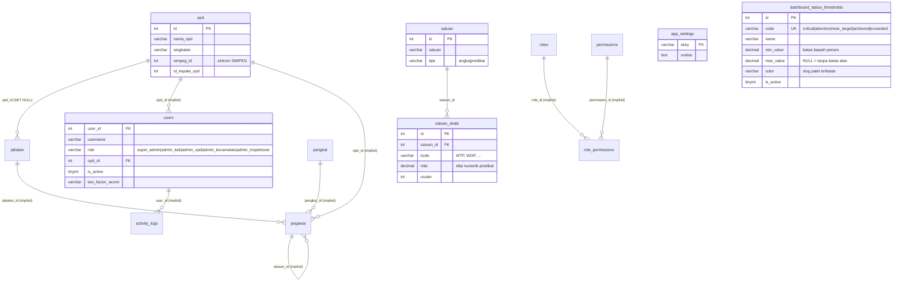
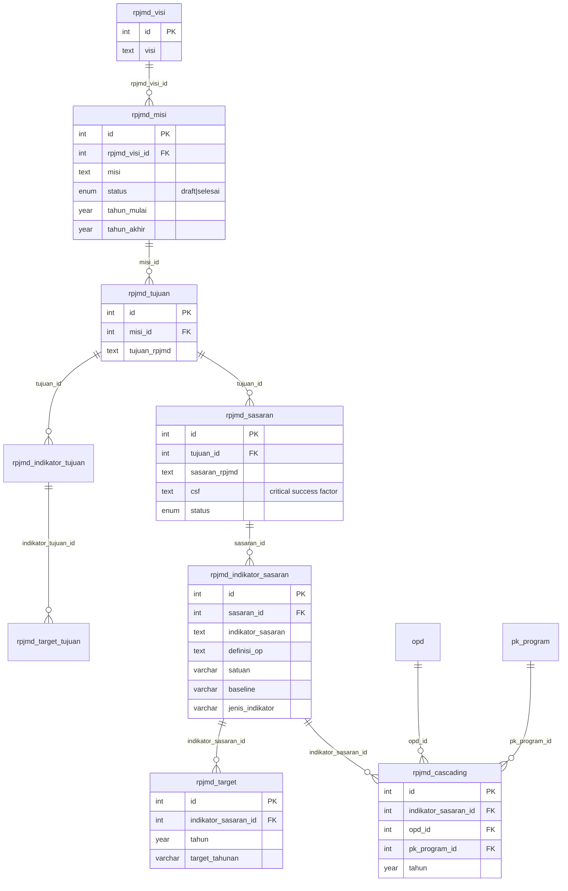
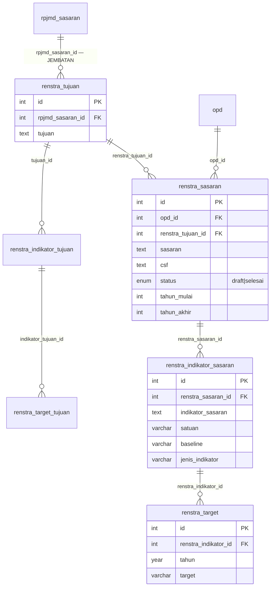
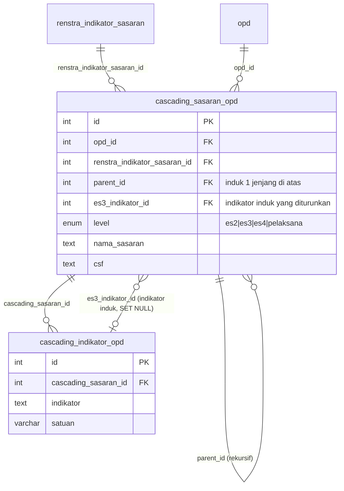
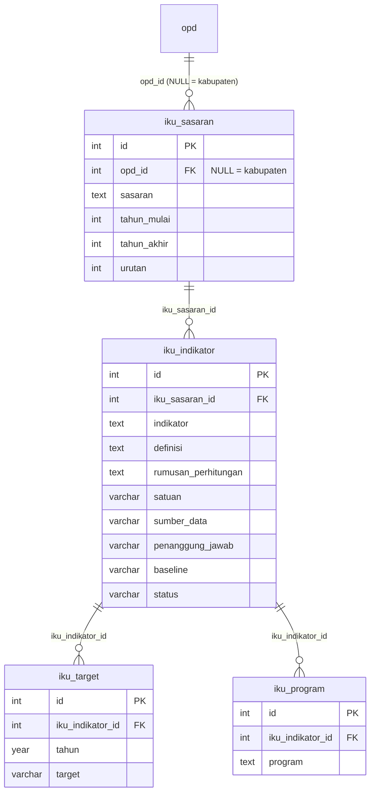
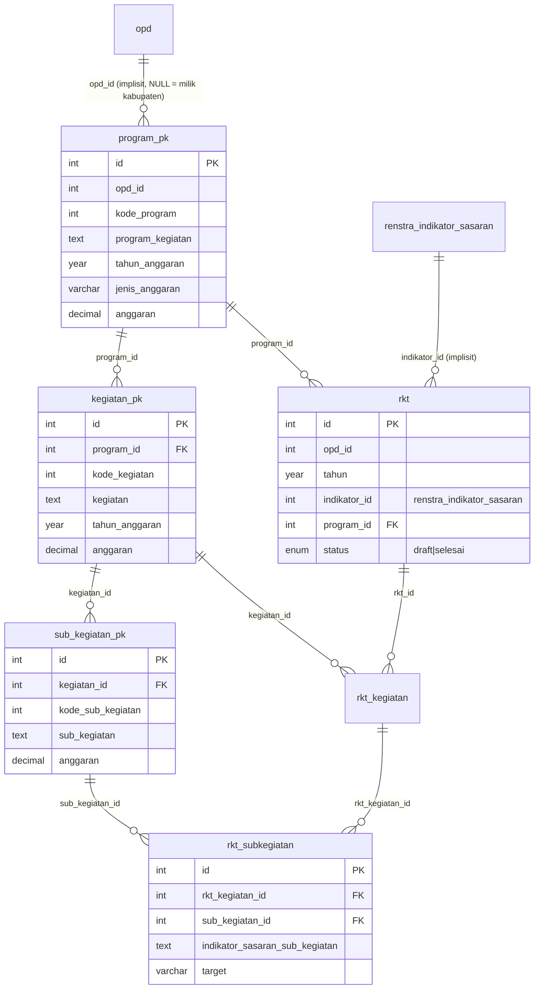
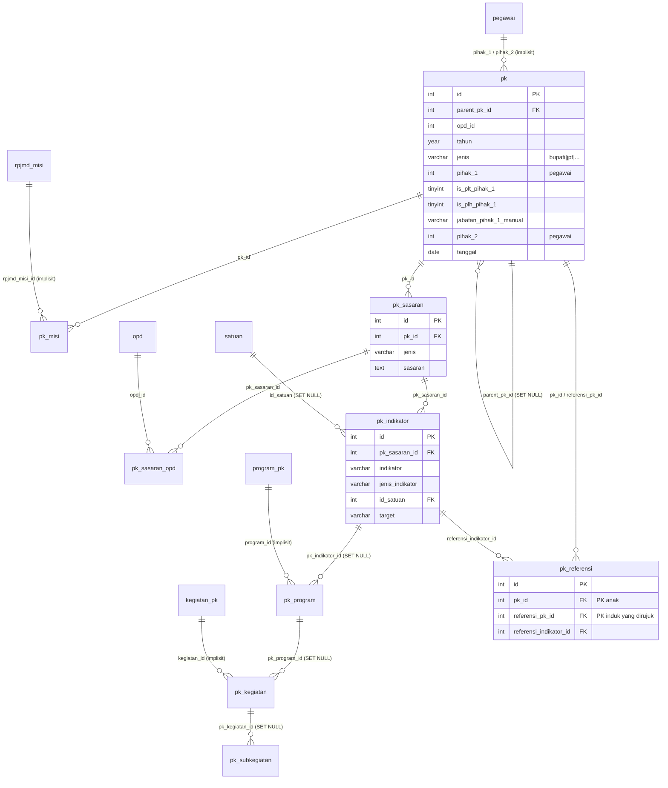
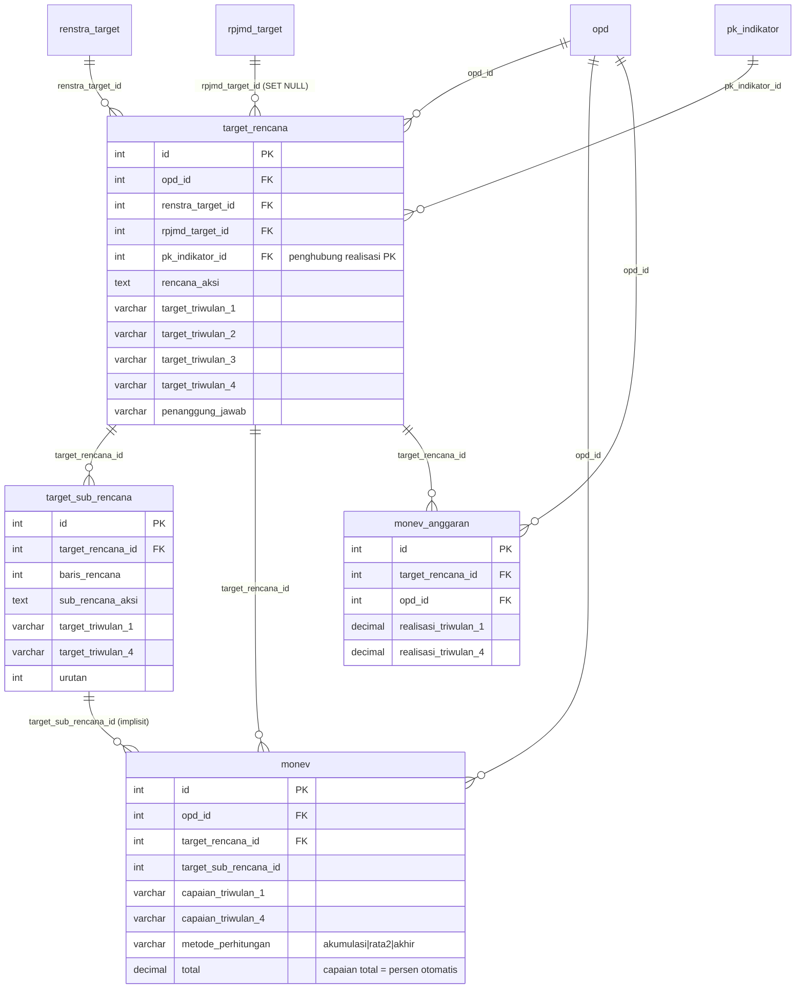
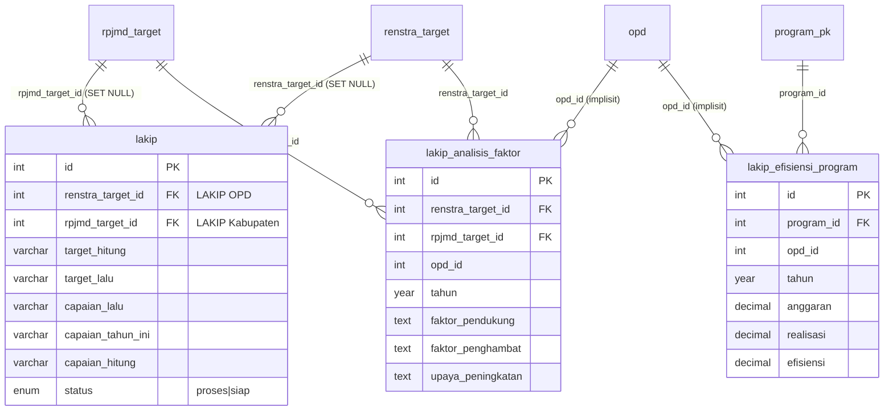

# ERD e-SAKIP — Database `test_sakip`

Diagram relasi entitas (ERD) hasil **introspeksi langsung** dari database live `test_sakip`
per **2026-07-28**: 62 tabel, 64 foreign key aktif.

Legenda:

- ✅ **FK** — foreign key benar-benar ada di database (`information_schema`)
- ⚠️ **implisit** — relasi hanya dijaga di kode aplikasi (join di Model), belum ada FK
- `CASCADE` / `SET NULL` — aksi `ON DELETE`

> ERD dipecah per modul supaya terbaca. Untuk narasi keselarasan SAKIP KemenPAN-RB
> (Perencanaan → Penetapan → Pengukuran → Pelaporan), lihat [RELASI_SAKIP.md](RELASI_SAKIP.md).

---

## 0. Peta Besar — alur dokumen SAKIP

---

## 1. Master & Hak Akses

`opd` adalah pusat gravitasi seluruh sistem — hampir semua modul menyaring datanya per OPD.

| Anak | Kolom | Induk | Status |
|---|---|---|---|
| jabatan | opd_id | opd.id | ✅ SET NULL |
| satuan_skala | satuan_id | satuan.id | ✅ CASCADE |
| users | opd_id | opd.id | ⚠️ implisit |
| pegawai | opd_id / jabatan_id / pangkat_id / atasan_id | opd / jabatan / pangkat / pegawai | ⚠️ implisit |
| role_permissions | role_id / permission_id | roles / permissions | ⚠️ implisit |
| activity_logs | user_id | users.user_id | ⚠️ implisit |

`app_settings` berdiri sendiri (key–value: nama aplikasi, logo, favicon, SEO, penandatangan).

`dashboard_status_thresholds` juga berdiri sendiri (tanpa FK): rentang persentase → status
capaian (Kritis … Melampaui Target) beserta warna & ikonnya, dikelola Super Admin lewat
`adminkab/dashboard-thresholds` dan dipakai oleh Dashboard OPD maupun Dashboard Kabupaten.

---

## 2. RPJMD — perencanaan kabupaten

Rantai lurus 5 tingkat: **visi → misi → tujuan → sasaran → indikator → target tahunan**,
dengan cabang indikator tujuan di sisi tujuan.

Semua relasi di atas ✅ **FK CASCADE**. `rpjmd_cascading` = pohon kinerja tingkat kabupaten:
memetakan tiap indikator sasaran RPJMD ke **OPD penanggung jawab + program**.
Indikator tanpa baris di sini = *gap* (indikator tanpa penanggung jawab).

---

## 3. Renstra OPD — dan jembatan ke RPJMD

Titik keselarasan vertikal ada di `renstra_tujuan.rpjmd_sasaran_id`.

Seluruh relasi ✅ **FK CASCADE**. Renstra tanpa `rpjmd_sasaran_id` = Renstra "menggantung"
(tidak selaras dengan RPJMD).

---

## 4. Cascading / Pohon Kinerja OPD

Satu tabel rekursif menampung 4 jenjang lewat kolom `level` + `parent_id`.

Jenjang: **Eselon II → Eselon III → Eselon IV/JF → Pelaksana**.
Untuk role `admin_kecamatan`, label eselon digeser satu tingkat (II→III, III→IV, IV/JF→Pelaksana)
— murni kosmetik, nilai `level` di database tetap `es2/es3/es4`.

---

## 5. IKU — Indikator Kinerja Utama (modul mandiri)

Sejak 2026-07-27 IKU berdiri sendiri, tidak lagi menumpang indikator RPJMD/Renstra.
`iku_sasaran.opd_id` **NULL = IKU Kabupaten**, terisi = IKU OPD.

Semua ✅ **FK CASCADE**.

**Tabel lama (deprecated, tidak dihapus):** `iku` (`rpjmd_id`, `renstra_id` — ⚠️ tanpa FK)
dan `iku_program_pendukung` (`iku_id` ✅ FK CASCADE). Tidak dipakai modul IKU baru.

---

## 6. Program–Kegiatan–Sub Kegiatan & RKT

FK aktif: `kegiatan_pk.program_id`, `sub_kegiatan_pk.kegiatan_id`, `rkt.program_id`,
`rkt_kegiatan.rkt_id`, `rkt_kegiatan.kegiatan_id`, `rkt_subkegiatan.rkt_kegiatan_id`,
`rkt_subkegiatan.sub_kegiatan_id` — semuanya CASCADE.
⚠️ Tanpa FK: `program_pk.opd_id`, `rkt.opd_id`, `rkt.indikator_id`.

---

## 7. Perjanjian Kinerja (PK)

`pk` bersifat rekursif (`parent_pk_id`) untuk berjenjang Bupati → Eselon II → III → IV.

`pk_referensi` = mekanisme *cascade* PK: indikator PK atasan dirujuk oleh PK bawahan.
`pk_sasaran_opd` menandai OPD pengampu sasaran PK Bupati.
Menu **PK JPT** dan **PK Kecamatan** memakai data yang sama (`pk.jenis='jpt'`), pemisahan hanya di rute/tampilan.

---

## 8. Rencana Aksi, Target & MONEV — inti pengukuran

`target_rencana` adalah simpul yang menyatukan tiga sumber target: RPJMD, Renstra, dan PK.

`target_rencana.pk_indikator_id` adalah kunci monitoring realisasi PK (Bupati & Eselon II/III/IV):
realisasi PK dibaca dari MONEV lewat rantai ini, bukan dari tabel capaian PK lama.

---

## 9. LAKIP — pelaporan kinerja

Satu baris `lakip` mengisi tepat **salah satu** dari `rpjmd_target_id` (LAKIP Kabupaten)
atau `renstra_target_id` (LAKIP OPD) — pola yang sama dipakai `lakip_analisis_faktor`.
Program + pagu pada tabel efisiensi diambil dari `program_pk` melalui rantai PK.

---

## 10. Catatan skema

**Tabel cadangan (bukan bagian model, aman diabaikan/dihapus):**
`_backup_monev_total_20260727`, `_bak_target_rencana_capaian_20260727`.

**Relasi implisit yang paling berisiko** (belum dijaga FK, mudah jadi data yatim):

| Kolom | Seharusnya menunjuk | Dampak bila yatim |
|---|---|---|
| `users.opd_id` | `opd.id` | user tanpa OPD → data kosong di semua menu |
| `program_pk.opd_id` | `opd.id` | program tak terbaca di RKT/PK OPD |
| `rkt.indikator_id` | `renstra_indikator_sasaran.id` | RKT lepas dari Renstra |
| `pk.opd_id`, `pk.pihak_1/2` | `opd.id`, `pegawai.id` | PK tanpa penandatangan/OPD |
| `monev.target_sub_rencana_id` | `target_sub_rencana.id` | capaian sub rencana menggantung |
| `iku.rpjmd_id`, `iku.renstra_id` | tabel IKU lama — sudah tidak dipakai | — |

**Konvensi FK yang berlaku:** `ON UPDATE CASCADE`; `ON DELETE CASCADE` untuk relasi
struktural induk–anak, `ON DELETE SET NULL` untuk pointer opsional
(`cascading_sasaran_opd.es3_indikator_id`, `lakip.*_target_id`, `pk.parent_pk_id`, `pk_indikator.id_satuan`).
