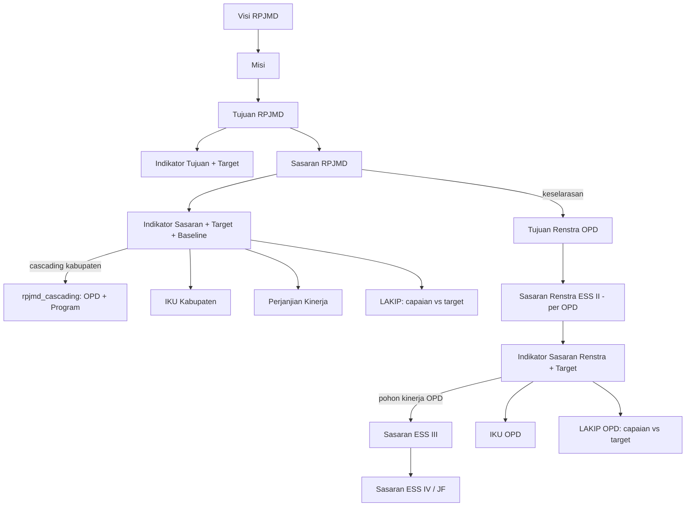
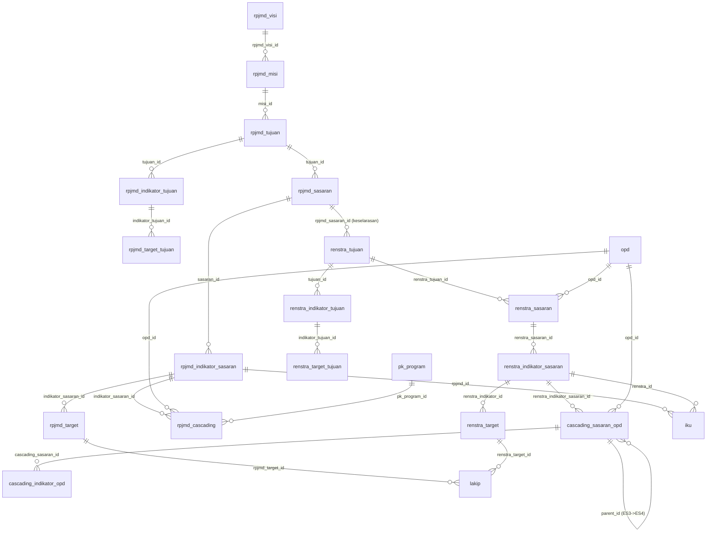

# Relasi Data SAKIP — e-SAKIP Kabupaten Pringsewu

Dokumentasi model data & keterkaitan antar tabel untuk modul **RPJMD, Renstra, IKU, LAKIP, dan Cascading (Pohon Kinerja)**, diselaraskan dengan kerangka **SAKIP KemenPAN-RB** yang berlaku saat ini.

> Sumber: hasil introspeksi skema database `test_sakip` (per 2026-06-28).

---

## 1. Dasar Kerangka SAKIP (KemenPAN-RB)

Rantai akuntabilitas kinerja mengikuti alur **Perencanaan → Penetapan → Pengukuran → Pelaporan → Evaluasi**:

| Tahap | Dokumen SAKIP | Modul di Aplikasi | Acuan Regulasi |
|------|----------------|-------------------|----------------|
| Perencanaan strategis daerah | RPJMD / RPD | **RPJMD** | Permendagri 90/2019 jo. Kepmendagri 050-3708/2020 |
| Perencanaan strategis PD | Renstra Perangkat Daerah | **Renstra** | PermenPAN-RB 89/2021 |
| Penjabaran kinerja | Pohon Kinerja / Cascading (Eselon II→III→IV/JF) | **Cascading** | Panduan Pohon Kinerja KemenPAN-RB |
| Indikator utama | Indikator Kinerja Utama (IKU) | **IKU** | PermenPAN 09/2007; PermenPAN-RB 88/2021 |
| Penetapan kinerja | Perjanjian Kinerja (PK) | **PK** | PermenPAN-RB 89/2021 |
| Pengukuran | Pengukuran kinerja / MONEV | **Target & MONEV** | PermenPAN-RB 88/2021 |
| Pelaporan | Laporan Kinerja (LKj/LAKIP) | **LAKIP** | PermenPAN-RB 53/2014 jo. 88/2021 |

Prinsip kunci: **keselarasan vertikal** (RPJMD → Renstra → Pohon Kinerja → PK) dan **keterukuran** (setiap indikator memiliki satuan, baseline, dan target tahunan yang diukur di LAKIP).

---

## 2. Diagram Keselarasan (Cascading SAKIP)

---

## 3. ERD Teknis (tabel & relasi nyata)

---

## 4. Daftar Relasi (parent → child)

Legenda status: ✅ = FK aktif di DB · ⚠️ = relasi implisit (belum ada FK). Per **2026-06-28**, 13 FK baru diterapkan via `db/update_2026-06-28_fk.sql` (lihat §6).

### RPJMD
| Anak | Kolom | Induk | FK |
|------|-------|-------|----|
| rpjmd_misi | rpjmd_visi_id | rpjmd_visi.id | ✅ |
| rpjmd_tujuan | misi_id | rpjmd_misi.id | ✅ |
| rpjmd_indikator_tujuan | tujuan_id | rpjmd_tujuan.id | ✅ |
| rpjmd_target_tujuan | indikator_tujuan_id | rpjmd_indikator_tujuan.id | ✅ |
| rpjmd_sasaran | tujuan_id | rpjmd_tujuan.id | ✅ |
| rpjmd_indikator_sasaran | sasaran_id | rpjmd_sasaran.id | ✅ |
| rpjmd_target | indikator_sasaran_id | rpjmd_indikator_sasaran.id | ✅ |

### Renstra
| Anak | Kolom | Induk | FK |
|------|-------|-------|----|
| renstra_tujuan | rpjmd_sasaran_id | rpjmd_sasaran.id | ✅ (anchor keselarasan RPJMD→Renstra) |
| renstra_indikator_tujuan | tujuan_id | renstra_tujuan.id | ✅ |
| renstra_target_tujuan | indikator_tujuan_id | renstra_indikator_tujuan.id | ✅ |
| renstra_sasaran | renstra_tujuan_id | renstra_tujuan.id | ✅ |
| renstra_sasaran | opd_id | opd.id | ✅ |
| renstra_indikator_sasaran | renstra_sasaran_id | renstra_sasaran.id | ✅ |
| renstra_target | renstra_indikator_id | renstra_indikator_sasaran.id | ✅ |

### Cascading (Pohon Kinerja)
| Anak | Kolom | Induk | FK |
|------|-------|-------|----|
| rpjmd_cascading | indikator_sasaran_id | rpjmd_indikator_sasaran.id | ✅ |
| rpjmd_cascading | opd_id | opd.id | ✅ |
| rpjmd_cascading | pk_program_id | pk_program.id | ✅ |
| cascading_sasaran_opd | renstra_indikator_sasaran_id | renstra_indikator_sasaran.id | ✅ |
| cascading_sasaran_opd | parent_id | cascading_sasaran_opd.id | ✅ |
| cascading_sasaran_opd | opd_id | opd.id | ✅ |
| cascading_sasaran_opd | es3_indikator_id | cascading_indikator_opd.id | ✅ (ON DELETE SET NULL) |
| cascading_indikator_opd | cascading_sasaran_id | cascading_sasaran_opd.id | ✅ |

### IKU
| Anak | Kolom | Induk | FK |
|------|-------|-------|----|
| iku | rpjmd_id | rpjmd_indikator_sasaran.id *(IKU Kabupaten)* | ⚠️ perlu verifikasi |
| iku | renstra_id | renstra_indikator_sasaran.id *(IKU OPD)* | ⚠️ perlu verifikasi |

### LAKIP
| Anak | Kolom | Induk | FK |
|------|-------|-------|----|
| lakip | rpjmd_target_id | rpjmd_target.id *(LAKIP Kabupaten)* | ✅ |
| lakip | renstra_target_id | renstra_target.id *(LAKIP OPD)* | ✅ |

---

## 5. Catatan Keselarasan (sesuai KemenPAN-RB)

1. **Jembatan RPJMD → Renstra** ada di `renstra_tujuan.rpjmd_sasaran_id` → `rpjmd_sasaran.id`. Inilah titik keselarasan vertikal; sebaiknya **wajib terisi** (NOT NULL setelah data bersih) agar tidak ada Renstra "menggantung".
2. **Pohon Kinerja Kabupaten** = `rpjmd_indikator_sasaran` dipetakan ke **OPD + Program** lewat `rpjmd_cascading`. Indikator tanpa baris di `rpjmd_cascading` = **gap** (indikator tanpa penanggung jawab).
3. **Pohon Kinerja OPD** = `cascading_sasaran_opd` (level `es3`/`es4`, self-reference via `parent_id`) turunan dari `renstra_indikator_sasaran`.
4. **Keterukuran**: setiap indikator (RPJMD & Renstra) idealnya punya `satuan`, `baseline`, dan `target` per tahun (`rpjmd_target` / `renstra_target`) yang menjadi pembanding **capaian** di `lakip`.
5. **IKU** memilih indikator kunci dari RPJMD (`rpjmd_id`) atau Renstra (`renstra_id`) — disarankan menstandарkan agar hanya salah satu terisi sesuai level.

---

## 6. Penguatan Integritas Referensial — STATUS: DITERAPKAN (2026-06-28)

Penguatan relasi sudah dijalankan ke database `test_sakip`. **13 Foreign Key baru** ditambahkan via skrip idempotent [`db/update_2026-06-28_fk.sql`](update_2026-06-28_fk.sql), mengikuti konvensi FK yang sudah ada (`ON UPDATE CASCADE`; `ON DELETE CASCADE` untuk relasi struktural induk-anak, `ON DELETE SET NULL` untuk soft-pointer nullable `cascading_sasaran_opd.es3_indikator_id`).

**Pra-penerapan terverifikasi:** semua tabel `InnoDB`, tipe kolom kompatibel, dan pemeriksaan orphan menunjukkan hanya 2 baris bermasalah.

**Pembersihan data:** 2 baris `renstra_sasaran` (id 35 & 58, status `draft`, `opd_id=1` yang tidak ada di tabel `opd` — data uji "sasaran"/"sasaran2") beserta turunannya (2 indikator + 10 target) dihapus agar FK `renstra_sasaran.opd_id` valid.
- Backup baris yang dihapus: [`db/backup_orphan_renstra_2026-06-28.sql`](backup_orphan_renstra_2026-06-28.sql).
- **Restore bila perlu:** `mysql -u root test_sakip < db/backup_orphan_renstra_2026-06-28.sql` (jalankan sebelum FK aktif, atau hapus dulu FK terkait).

**Belum diterapkan (sengaja):**
- `iku.rpjmd_id` & `iku.renstra_id` — makna kolom (apakah mengacu ke `rpjmd_indikator_sasaran`/`renstra_indikator_sasaran` atau ke level sasaran) perlu diverifikasi lebih dulu sebelum diberi FK. Kandidat FK tersedia bila sudah pasti.

> ℹ️ Skrip bersifat **idempoten** — aman dijalankan ulang; FK yang sudah ada dilewati oleh prosedur `_add_fk_if_absent`.
